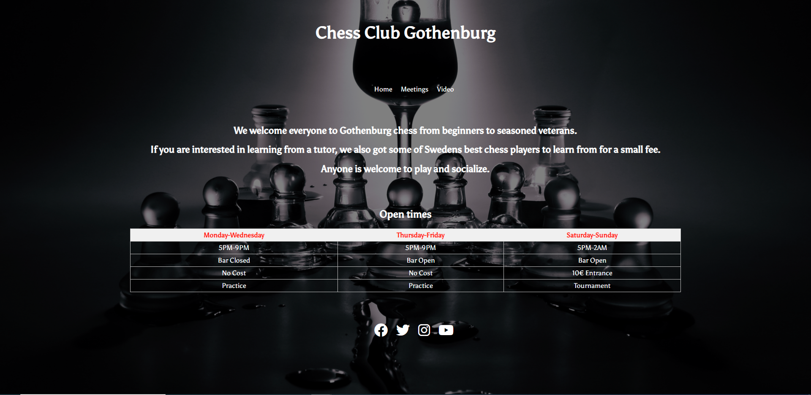

# Chess Club Gothenburg

Chess club Gothenburg is a meeting place for chess enthusiast of all ages and skill.
The club is open for beginners as well as experts of the game as well.
Play for fun or join our weekend tournaments. This website is made so that chess enthusiast 
In Gothenburg can get some info and sign up with us as well as see what days we are open.

# Features

## Navigation

- At the top middle of the page, we got the Chess club Gothenburg in the biggest text on the page.

- The navigation of the site you find to the right of the club gotenburg title.

- The navigation links are Home, Meetings and Videos.

- You get the name of the club by the navigation and a good understanding of what the three navigation links informs about.

# The Home Page

- The home page is the first page you visit.
- The page explains its a chess club in Gothenburg that also do tutoring.
- The  has a sign up form on the right to sign up.
- You also see the club socials.

# Meetings Page

- The meetings page, you get clear information about everything the club offers.
- You have the open times in a table, also more info in the table depending on what day it is.
- The socials on the bottom center of the page.

# Video Page 

- On the video page you have a YouTube educational video about chess.
- There is a socials page at the center bottom as well as on all the other pages.

# Testing

- I have tested that the website works good on Chrome, Internet Explorer and Firefox.

- The webpage is responsive i tested it using google chrome dev tools.

- The Sign up form works well it will only let you put in the right information if not it wont allow you to send it.

- Tested all the social media links so they bring you to their site in an open tab.

# Bugs

## Solved bugs

- I had alot of problems with typos that cost me some time to find out the problem was just a typo. 
Mistyping classes or targeting code wrong that cost time.

- Had some problems with getting text and some picture in the location i wanted solved it with the position command.

## Unsolved bugs

- None that i know of.

# Validator Testing

- HTML No errors with the W3C validator.

- CSS No errors with the W3C validator.

- I used lighthouse to test the page and tried to make the site as easy in colors as possible so even someone with problems with seeing can see it clearly.

# Deployment 

- The site is deployed to github paged.

- To deploy i whent to my github Repositories.

- clicked on my project.

- Then clicked on the settings button, then scrolled down to GitHub Pages and clicked that.

- Clicked Main/Root then deployed the site.

The Link to the website - [Chess Club](https://tobbe8808.github.io/project1/)

# Credits

## Content

- I used W3Sschools [W3S](https://www.w3schools.com/)
- I used some knowledge from the Love Running Project.
- I used tutorialspoint [Tutorialspoint(https://www.tutorialspoint.com/css/)
- I lookt at a few diffrent Youtube Tutorials [YouTube](https://www.tutorialspoint.com/css/)

